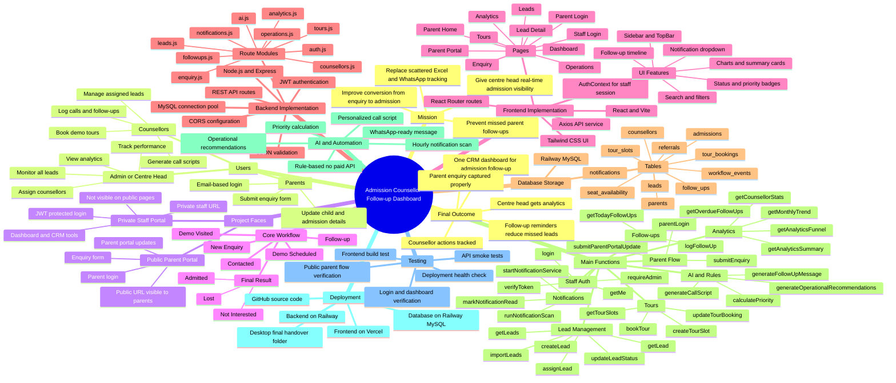

# Admission Counsellor Follow-up Dashboard - Mind Map

Use this mind map to explain the project in review, report, or PPT.

## Quick Explanation Script

This mind map shows the complete structure of our project. At the centre, we have the Admission Counsellor Follow-up Dashboard. The mission is to replace manual Excel and WhatsApp tracking with a proper CRM system for admissions.

The system has two faces. The public parent portal is for parents to login with email and submit enquiry details. The private staff portal is for counsellors, admins, and centre heads. Staff access is protected and not visible on public pages.

The main workflow starts from a new enquiry and moves through contacted, demo scheduled, demo visited, follow-up, and finally admitted, not interested, or lost.

Frontend is built using React, Vite, Tailwind CSS, React Router, Axios, and AuthContext. Backend is built using Node.js, Express, JWT authentication, and MySQL connection pool. Data is stored in Railway MySQL tables like leads, follow-ups, counsellors, tour bookings, admissions, and notifications.

The important functions handle login, parent enquiry submission, lead management, follow-up logging, tour booking, analytics, rule-based AI scripts, priority calculation, and automatic notifications.

The final output is a working admission CRM where parents can submit enquiries, counsellors can track every follow-up, and centre heads can monitor performance and conversion.

